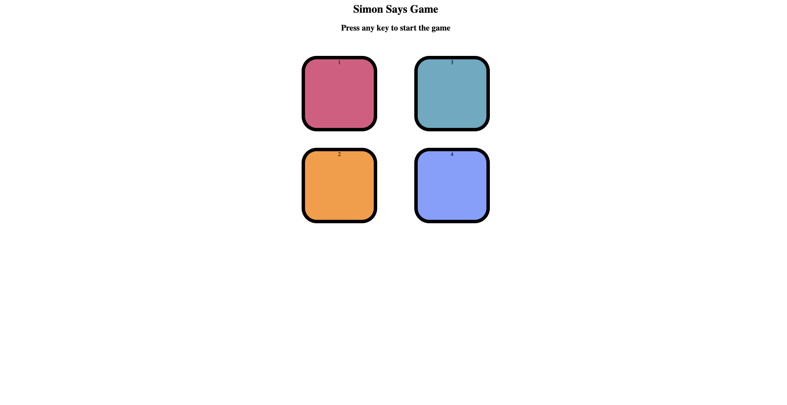

🟢🟡🔴🟣 # Simon Says Game
A simple and interactive Simon Says memory game built with HTML, CSS, and JavaScript. Test your memory by following the color sequence and try to reach the highest level!
🕹️ Gameplay
The game starts when the user presses any key.
A sequence of colors will flash—each level adds a new color.
Click the buttons in the correct order to move to the next level.
If you click the wrong color, the game ends and shows your score.
Press any key to restart.
✨ Features
Clean and responsive UI.
Dynamic level counter.
Sound effects (can be added easily).
Flash animation on button click and sequence.
Tracks and displays the user's score when the game ends.
📁 Project Structure
/simon-game
│
├── index.html      # Main HTML structure
├── style.css       # Styling for the game
└── script.js       # JavaScript logic (game engine)
🛠️ Technologies Used
HTML5
CSS3
JavaScript (Vanilla)
🚀 Getting Started
Clone the repo:
git clone https://github.com/your-username/simon-says-game.git
Open index.html in your browser to start playing!
📸 Screenshots

Insert a few images or GIFs of your game here if available.
💡 Future Improvements
Add sound effects for each button.
Save high score using localStorage.
Add difficulty levels or modes.
Make it mobile-friendly with touch support.
🧑‍💻 Author
Sagar Katoch
📧 katochsagar2@gmail.com
Feel free to fork, star ⭐, and contribute to this project!